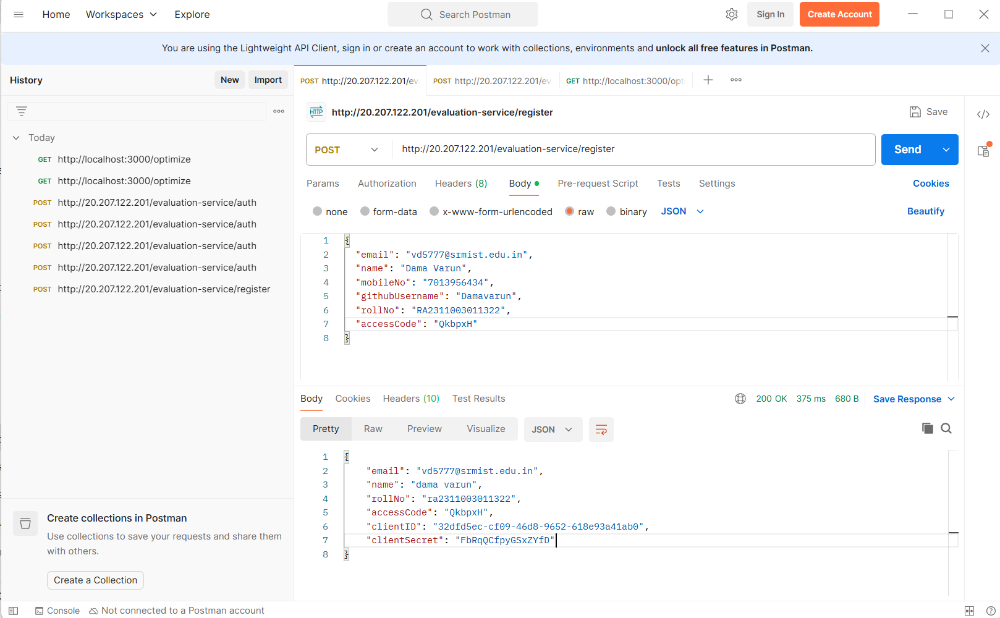
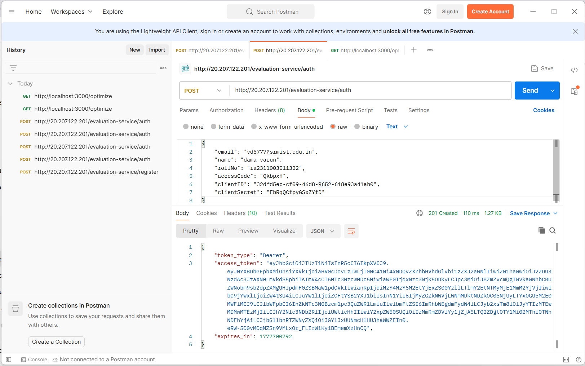
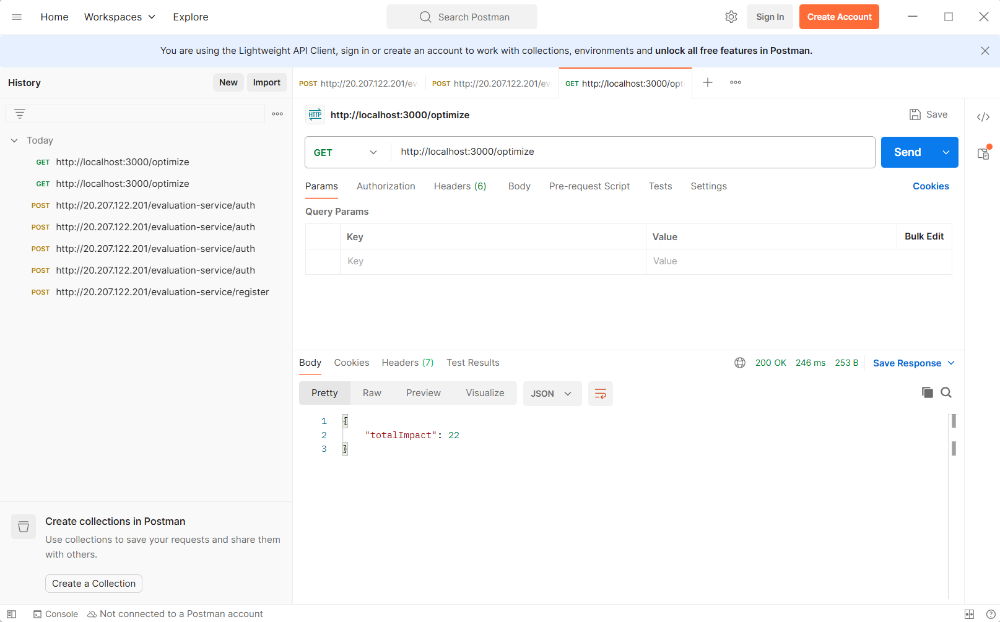

# Vehicle Maintenance Scheduler with Logging Middleware

## Overview

This project is a backend microservice that optimizes vehicle maintenance scheduling using the **0/1 Knapsack algorithm**.

Each task has:

* **Duration** → time required
* **Impact** → importance score

The system selects the optimal subset of tasks within limited hours to **maximize total impact**.

---

## Project Structure

```
RA2311003011322/
├── logging_middleware/
│   └── logger.js
├── vehicle_maintenance_scheduler/
│   ├── src/
│   │   ├── controller.js
│   │   ├── index.js
│   │   ├── service.js
│   ├── package.json
│   └── .env
├── notification_system_design.md
├── README.md
└── .gitignore
```

---

## Setup Steps

### 1. Install Dependencies

```bash
cd vehicle_maintenance_scheduler
npm install
```

---

### 2. Configure Environment

Create `.env` file:

```
TOKEN=your_access_token
```

---

### 3. Get Access Token

1. POST `/evaluation-service/register`
2. POST `/evaluation-service/auth`
3. Copy `access_token` into `.env`

---

### 4. Run Server

```bash
node src/index.js
```

Server runs at:

```
http://localhost:3000
```

---

## API Endpoint

### GET /optimize

**Request:**

```
http://localhost:3000/optimize
```

---

###  Response

```json
{
  "totalImpact": 22,
  "selectedTasks": [
    {
      "Duration": 2,
      "Impact": 5
    },
    {
      "Duration": 3,
      "Impact": 7
    },
    {
      "Duration": 5,
      "Impact": 10
    }
  ]
}
```

---

##  Algorithm Explanation

This problem is solved using the **0/1 Knapsack algorithm**:

* Duration → Weight
* Impact → Value
* Max Hours → Capacity

Dynamic Programming is used to compute optimal value, followed by **backtracking** to retrieve selected tasks.

---

##  Logging Middleware

A reusable logging function is implemented:

```js
Log(stack, level, package, message)
```

### Example:

```js
await Log("backend", "info", "controller", "Optimize called");
```

Logs are sent to:

```
/evaluation-service/logs
```

---

##  Features

* API integration with external service
* Token-based authentication
* Centralized logging middleware
* Dynamic Programming optimization
* Clean modular architecture

---

##  Tech Stack

* Node.js
* Express.js
* Axios
* Dotenv

---

## Screenshots

### Register API


---

### Auth API


---

### Optimize API


---

## 👤 Author

**Roll Number:** RA2311003011322
**GitHub:** https://github.com/Damavarun
